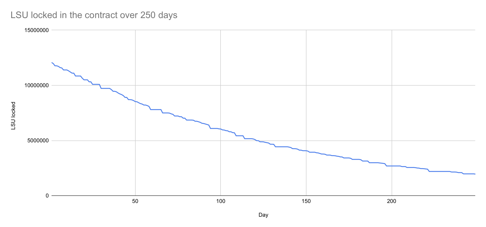

# Gable Current Recovery Plan Simulation

## Overview
This guide provides results of simulation of Gable current recovery plan and instructions on how to run this simulation. This process requires the latest snapshot of the radix database. Follow the steps below to correctly set up and run the simulation.

The program is simulating a recovery plan which involves cooperation with top three locked LSU holders. It adds 8000 XRD a reward from validator and lets random users withdraw their NFTs with LSU. At the end of simulation, all but 3 last users are able to withdraw recover locked LSU. Due to a different issue, one NFT with smallest claim from every NFT group is skipped. This behavior can be changed by changing `simulation.get_lsu_claims(false)` argument from false to true in `bin/simulation.rs`.

## Results of simulation (9th April 2024)

As for 9th April 2024, there are 525 NFTs with around 12M LSU (equivalent of 12M XRD) locked in the smart contract. The validator is currencly adding a reward of around 3744 XRD every 12 hours. 

The simulation with this conditions is available in the file `simulation_9_04_24.txt`. The top three NFTs with highest LSU claim are:
- NFT: #714# with LSU: 1000000 and XRD claim: 64522.435190263402191751
- NFT: #352# with LSU: 653000 and XRD claim: 85421.826944644686809991
- NFT: #573# with LSU: 311000 and XRD claim: 20261.293689665313671067

To withdraw all other NFTs from smart contract, 249 days with ~8000 XRD validator rewards each day are required. The number of LSU locked in smart contract over those days is represented by this graph:



## Running the simulation

### Prerequisites
- Ensure you have `rust` and `cargo` installed on your system to run the simulation.

### Downloading the Database Snapshot
1. Visit [Radix Snapshots](https://snapshots.radix.live/) to download the latest snapshot of the radix database.
2. Unpack the downloaded snapshot to your desired location on your system.

### Setting Up the Environment Variable
1. Locate the `state_manager` directory within the unpacked snapshot.
2. Set the `STATE_MANAGER_DATABASE_PATH` environment variable to the path of the `state_manager` directory. This enables the simulation to correctly access the database. Use the following command in your terminal, replacing the path with your specific directory path:

```bash
export STATE_MANAGER_DATABASE_PATH="/path/to/your/state_manager"
```

For example:

```bash
export STATE_MANAGER_DATABASE_PATH="/home/bbarw/babylon-ledger/state_manager/"
```

### Running the Simulation
With the environment variable set, you can now run the simulation. Execute the following command in your terminal:

```bash
ulimit -n 65000
cargo run --release
```
